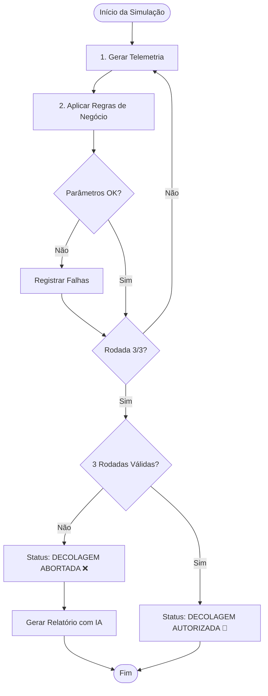

# 🚀 Missão Aurora Siger 


Projeto desenvolvido para o **Project Based Learning (PBL)** da FIAP, com foco em simulação computacional de uma missão em Marte, integrando análise de telemetria, gerenciamento de pouso, inteligência operacional e modelagem da infraestrutura da colônia.

<br>

## Visão Geral

O projeto evolui em cinco fases integradas, cobrindo desde a validação inicial da missão até a criação de um núcleo cognitivo para organizar dados e apoiar decisões na base marciana. Ao longo do sistema, são aplicados conceitos de lógica, estruturas de dados, algoritmos, modelagem matemática, arquivos, engenharia de prompts e otimização computacional para representar desafios reais de automação e tomada de decisão em ambiente crítico.

<br>

## Fases do Projeto
  
### 🚀 Fase 1: Simulação de telemetria e validação de lançamento

Realiza a validação inicial da missão por meio da análise de telemetria, da checagem automatizada de pré-lançamento e da identificação de anomalias, verificando se as condições operacionais permitem autorizar ou abortar a decolagem.

<details>
<summary>Clique para ver a Fase 1 em detalhe</summary>
  
## Visão Geral da Fase

Esta fase concentra a análise inicial da missão, verificando se a nave apresenta condições adequadas para iniciar a operação. O sistema interpreta os dados recebidos, aplica critérios de validação e apresenta um diagnóstico técnico da situação operacional.

## Objetivo da Fase

- **Simulação de telemetria:** geração de dados randômicos para parâmetros críticos do foguete, como temperatura, pressão, energia, integridade estrutural e módulos críticos.
- **Verificação de segurança:** execução de uma sequência de 3 testes pré-lançamento, validando a telemetria com base em regras de negócio.
- **Relatórios detalhados no console:** exibição de diagnósticos claros para cada rodada, destacando sucessos, falhas e anomalias detectadas.
- **Análise com IA (Gemini):** em caso de falha, geração de um relatório técnico estruturado com apoio de IA para interpretação das anomalias.

## Parâmetros monitorados
Durante a simulação, a camada de telemetria monitora:
- **Temperatura:** condições térmicas internas e externas da nave.
- **Integridade estrutural:** status da fuselagem e da estrutura principal.
- **Energia:** carga disponível para sistemas essenciais.
- **Pressão:** monitoramento dos tanques em faixa operacional segura.
- **Módulos críticos:** verificação dos sistemas indispensáveis para a missão.

## Regras de negócio de segurança

Para que a decolagem seja autorizada, todos os critérios abaixo devem ser satisfeitos em 3 rodadas consecutivas:

- **Integridade estrutural:** deve estar operacional.
- **Energia:** mínimo de 80%.
- **Pressão:** entre 300 e 450 psi.
- **Temperatura interna:** entre 18°C e 25°C.
- **Módulos críticos:** todos com status `OK`.

Se qualquer uma dessas condições falhar em uma rodada, o teste é marcado como falho e a missão é abortada ao final da sequência, com emissão de relatório técnico complementar.


##  Arquitetura e Fluxo de Decisão

Em alto nível, o sistema segue o fluxo:

1. **Geração de telemetria simulada** (valores aleatórios dentro/fora dos limites).

2. **Aplicação das regras de negócio** para cada rodada de teste.

3. **Cálculo do status da missão** (GO / NO-GO) após 3 rodadas.

4. **Em caso de falha**:

    * Registro das anomalias por rodada.

    * Geração de relatório técnico com IA (Gemini).


## Fluxo de Decisão da Missão


## Exemplo de saída no console
```text

=====================================================================================
              Sejam bem-vindos ao sistema de telemetria da MISSÃO AURORA             
                   Iniciando sequência de 3 testes obrigatórios...                   
=====================================================================================
-------------------------------------------------------------------------------------
|                              RELATÓRIO DE RODADA: 1/3                             |
|                                                                                   |
| TESTE FALHOU                                                                      |
| Rodada 1: Anomalias detectadas.                                                   |
| -------------------------------------------------------------                     |
| VERIFICAÇÃO DE SEGURANÇA:                                                         |
|   > Bateria Útil p/ Sistema: 3039.19 kWh                                          |
|   > Custo de Decolagem.....: 463.78 kWh                                           |
|   > Autonomia energética pós decolagem...: 67.83%                                 |
|   > Temp. Interna: 13.08 C°                                                       |
|   > Temp. Externa: -7.10 C°                                                       |
|   > Integridade: OK                                                               |
|   > Pressão: 422.22 psi                                                           |
| -----------------------------------------------------------------                 |
| ERROS ENCONTRADOS:                                                                |
| - FALHA NA INTEGRIDADE ESTRUTURAL                                                 |
| - Temperatura interna fora do padrão: 13.08 C°                                    |
| - Temperatura externa fora do padrão: -7.10 C°                                    |
| - FALHA NOS MÓDULOS CRÍTICOS                                                      |
| - RISCO DE BLACKOUT: Saldo de 67.83% (Min: 80%)                                   |
|                                                                                   |
-------------------------------------------------------------------------------------
-------------------------------------------------------------------------------------
|                              RELATÓRIO DE RODADA: 2/3                             |
|                                                                                   |
| TESTE FALHOU                                                                      |
| Rodada 2: Anomalias detectadas.                                                   |
| -------------------------------------------------------------                     |
| VERIFICAÇÃO DE SEGURANÇA:                                                         |
|   > Bateria Útil p/ Sistema: 112.89 kWh                                           |
|   > Custo de Decolagem.....: 396.91 kWh                                           |
|   > Autonomia energética pós decolagem...: 6.28%                                  |
|   > Temp. Interna: 19.40 C°                                                       |
|   > Temp. Externa: 6.11 C°                                                        |
|   > Integridade: OK                                                               |
|   > Pressão: 463.72 psi                                                           |
| -----------------------------------------------------------------                 |
| ERROS ENCONTRADOS:                                                                |
| - FALHA NA INTEGRIDADE ESTRUTURAL                                                 |
| - Pressão fora dos padrões: 463.72 psi                                            |
| - RISCO DE BLACKOUT: Saldo de 6.28% (Min: 80%)                                    |
|                                                                                   |
-------------------------------------------------------------------------------------
-------------------------------------------------------------------------------------
|                              RELATÓRIO DE RODADA: 3/3                             |
|                                                                                   |
| TESTE FALHOU                                                                      |
| Rodada 3: Anomalias detectadas.                                                   |
| -------------------------------------------------------------                     |
| VERIFICAÇÃO DE SEGURANÇA:                                                         |
|   > Bateria Útil p/ Sistema: 1066.13 kWh                                          |
|   > Custo de Decolagem.....: 284.43 kWh                                           |
|   > Autonomia energética pós decolagem...: 45.58%                                 |
|   > Temp. Interna: 16.35 C°                                                       |
|   > Temp. Externa: 18.20 C°                                                       |
|   > Integridade: OK                                                               |
|   > Pressão: 384.69 psi                                                           |
| -----------------------------------------------------------------                 |
| ERROS ENCONTRADOS:                                                                |
| - FALHA NA INTEGRIDADE ESTRUTURAL                                                 |
| - Temperatura interna fora do padrão: 16.35 C°                                    |
| - FALHA NOS MÓDULOS CRÍTICOS                                                      |
| - RISCO DE BLACKOUT: Saldo de 45.58% (Min: 80%)                                   |
|                                                                                   |
-------------------------------------------------------------------------------------
=================================================================
RELATÓRIO DE RODADA: 0 Sucessos | 3 Falhas
STATUS: ABORTAR MISSÃO! Verifique os erros acima. 🛑

>>> STATUS FINAL: DECOLAGEM ABORTADA! ❌
A missão requer 3 sucessos consecutivos. Detectamos 3 falha(s).
18:35:44 - A equipe de engenharia está investigando as falhas.

--- ANÁLISE DO DIRETOR DE VOO (IA) ---
**BOLETIM TÉCNICO DE DIAGNÓSTICO – ABORTO DE LANÇAMENTO DA MISSÃO AURORA**

**CLASSIFICAÇÃO DOS DADOS:**

1.  **Integridade Estrutural/Mecânica:**
    *   FALHA NA INTEGRIDADE ESTRUTURAL
    *   Pressão fora dos padrões: 463.72 psi (Indica falha em sistema pressurizado ou vedação)
2.  **Sistemas Críticos/Funcionais:**
    *   FALHA NOS MÓDULOS CRÍTICOS
3.  **Subsistema Elétrico/Energia:**
    *   RISCO DE BLACKOUT: Saldo de 45.58% (Min: 80%)
    *   RISCO DE BLACKOUT: Saldo de 6.28% (Min: 80%)
    *   RISCO DE BLACKOUT: Saldo de 67.83% (Min: 80%)
4.  **Condições Ambientais/Térmicas:**
    *   Temperatura externa fora do padrão: -7.10 C°
    *   Temperatura interna fora do padrão: 13.08 C°
    *   Temperatura interna fora do padrão: 16.35 C°

---

**BOLETIM TÉCNICO DE DIAGNÓSTICO**

**STATUS:**
O lançamento da Missão Aurora foi imediatamente abortado. As verificações pré-lançamento indicaram falhas críticas em 3 de 3 testes, confirmando uma condição NO-GO.

**RISCO:**
O conjunto de anomalias registradas, isoladamente e em conjunto, cria um cenário de risco inaceitável de perda do veículo e da missão.
*   **Falha na Integridade Estrutural e Pressão Anormal:** Indica comprometimento físico da estrutura do veículo ou de seus subsistemas de propulsão/pressurização. Este cenário representa um risco iminente de desintegração catastrófica, explosão ou falha estrutural durante as fases de maior estresse dinâmico do voo, culminando na perda total do veículo e da carga útil.
*   **Falha nos Módulos Críticos:** Aponta para a inoperância ou desempenho degradado de componentes essenciais para controle de voo, navegação, telemetria, sistemas de segurança ou propulsão. A falha de qualquer um desses módulos pode levar à perda de controle da trajetória, incapacidade de executar comandos, falha na separação de estágios ou impossibilidade de abortar a missão de forma segura, resultando na perda do veículo.
*   **Múltiplos Riscos de Blackout:** Com saldos de energia muito abaixo do mínimo operacional exigido (45.58%, 6.28%, 67.83% frente a 80%), este é um indicativo claro de uma falha sistêmica e crítica no subsistema elétrico. A incapacidade de sustentar a alimentação de energia levaria à paralisação de todos os sistemas aviônicos e de suporte à vida a bordo, resultando em perda completa de controle, comunicação e, consequentemente, a perda do veículo em qualquer fase do voo.
*   **Temperaturas Internas e Externas Fora do Padrão:** Sugerem um ambiente operacional inadequado para os equipamentos. Temperaturas extremas podem causar falha eletrônica por superaquecimento ou congelamento, degradação de materiais, comprometimento da lubrificação de componentes mecânicos ou falha de isolamento, afetando diretamente a funcionalidade e estabilidade do veículo. A temperatura externa anormal também pode indicar condições climáticas impróprias ou falha nos sistemas de controle térmico do veículo.

**AÇÃO:**
1.  **Engenharia de Hardware:** Foco imediato na inspeção detalhada e diagnóstica das falhas estruturais, dos módulos críticos e do subsistema de pressurização/propulsão. Uma análise aprofundada da arquitetura elétrica e das baterias é imperativa para identificar a raiz dos múltiplos riscos de blackout. É crucial verificar os sensores e sistemas de controle térmico, bem como as condições ambientais da plataforma de lançamento.
2.  **Engenharia de Software:** Auditoria completa dos algoritmos de monitoramento e telemetria para garantir a precisão e robustez dos dados reportados. Revisão dos parâmetros de pré-lançamento e protocolos de verificação para identificar possíveis lacunas que permitiram a progressão a um estado de falha tão crítico. Desenvolver e testar atualizações de software para incorporar novas lógicas de detecção e mitigação baseadas nas descobertas de hardware.
=================================================================
```


## Reflexão Crítica
A exploração espacial é o reflexo dos valores da humanidade. Na Missão Aurora, a telemetria não apenas monitora máquinas, mas protege vidas e fundamenta uma presença humana ética e consciente.

###  Ética e Responsabilidade
A exploração espacial não é uma fuga dos problemas terrestres, mas uma busca por soluções globais. O espaço deve ser um bem comum, focado na ciência e na cooperação, evitando a militarização e garantindo que o progresso tecnológico beneficie toda a sociedade, não apenas grupos restritos.

###  Sustentabilidade e Lixo Espacial
A órbita terrestre é um recurso finito. Para evitar o Efeito Kessler (colisões em cadeia), a missão adota protocolos de Desórbita Programada: cada componente possui um fim de ciclo planejado, garantindo que a "estrada espacial" permaneça limpa e segura para as futuras gerações.

###  Impacto Social do Lançamento Tripulado
Enviar seres humanos ao espaço gera transformações profundas na estrutura social:

* Inspiração STEM: O "Efeito Apollo" atrai jovens para carreiras científicas e quebra barreiras sociais através da representatividade.

* Diplomacia Global: A manutenção da vida em órbita exige cooperação internacional, promovendo o diálogo e reforçando a identidade planetária (Overview Effect).

* Avanços na Medicina: A telemetria e o suporte à vida impulsionam a telemedicina, cirurgias robóticas e tratamentos de perda óssea/muscular para idosos na Terra.

* Cultura de Segurança: Os rigorosos protocolos de falha zero e as tecnologias de reciclagem de recursos (água e ar) são aplicados hoje em indústrias críticas e na gestão de desastres ambientais.

## Conclusão
Decolar exige mais que combustível; exige o compromisso de proteger quem parte, quem fica e o ambiente que nos cerca.

</details>

<br>

### 🚀 Fase 2: Módulo de Gestão de Pouso e Estabilização da Base (MGPEB)
Responsável por organizar a aproximação orbital, validar a ordem de prioridade dos módulos e controlar a liberação segura para pouso na colônia marciana.  
<details>
<summary>Clique para ver a fase 2 em detalhe:</summary>

## Visão Geral da Fase
Nesta fase, o sistema gerencia o processo de pouso dos módulos da missão, organizando a fila orbital, priorizando módulos críticos e validando quais estruturas podem ser liberadas para compor a base marciana.


## Objetivo da Fase
- Controlar a ordem de pouso com base em prioridade operacional.
- Separar módulos aptos para pouso e módulos em espera.
- Garantir organização lógica da implantação da colônia.
- Produzir saídas claras no terminal para acompanhamento da operação.


## Estruturas de Dados Utilizadas
O sistema gerencia os módulos (representados como dicionários) utilizando três conceitos de estruturas de dados lineares:
* **Fila de Pouso (`Queue` - FIFO):** Garante a regra de que o primeiro módulo a chegar/solicitar a descida seja o primeiro a ser processado (`pop(0)`).
* **Listas de Histórico (`List`):** Utilizadas para catalogar o destino final das entidades, divididas entre `lista_pousados` (sucesso na superfície) e `lista_espera` (módulos retidos em órbita por contingência).
* **Pilha de Alertas (`Stack` - LIFO):** Registra as anomalias climáticas e operacionais mais recentes no topo da pilha, garantindo que o último erro inserido seja o primeiro a ser exibido e tratado pelo painel (`pop()`).


## Algoritmos Implementados
Para processar e otimizar a fila de pouso, foram desenvolvidos dois algoritmos nativos (sem o uso de bibliotecas externas):
* **Busca Sequencial:** Varre a fila de pouso de forma linear para identificar instantaneamente qual módulo possui o menor nível crítico de combustível.
* **Insertion Sort (Ordenação por Inserção):** Reordena dinamicamente a fila com base na prioridade numérica do módulo (onde a prioridade 1 representa maior urgência), garantindo que os módulos de suporte médico e energético passem à frente.


## Portas Lógicas e Regras de Decisão
A autorização final para o pouso de cada módulo exige uma validação booleana composta através de operadores lógicos estritos:
1. **Regra de Sucesso Primária (`AND` Estrito):** O pouso só é executado com sucesso se:
   
   `combustivel_ok ∧ sensores_ok ∧ clima_ok ∧ area_livre`
3. **Regra de Contingência Energética:** Se um módulo apresentar combustível crítico ($\le 15\%$) mas não possuir prioridade alta, o sistema intercepta a entidade, eleva sua prioridade e reordena a fila.
4. **Regra de Retenção por Clima e Sensores:** Se o radar acusar clima adverso **E** os sensores do módulo estiverem em falha, o pouso é negado imediatamente e o evento é enviado para o topo da pilha de alertas.


## Exemplo de Entrada e Saída (Telemetria Simulada)
* **Entrada na Fila:** Módulos `MOD-MED-01` (Prioridade 1), `MOD-ENE-01` (Prioridade 2), `MOD-HAB-01` (Prioridade 3), `MOD-LOG-01` (Prioridade 4), `MOD-LAB-01` (Prioridade 5).
* **Saída no Terminal (Log de Operação):**
```
=====================================================================================
               INICIANDO FASE 2: APROXIMAÇÃO A MARTE E POUSO DE MÓDULOS              
=====================================================================================

Módulo com menor combustível detectado: MOD-LAB-01 (10.9%)

Fila de pouso configurada e ordenada por prioridade.

--- INICIANDO PROTOCOLO DE POUSO ---

[Analisando] MOD-MED-01 (Prioridade 1 | Combustível: 77.6%)
   -> RADAR METEOROLÓGICO: Detectado(s) Cisalhamento de Vento!
   -> FALHA: Pouso negado.
      Motivo: Condição atmosférica adversa. Entrando em espera.

[Analisando] MOD-ENE-01 (Prioridade 2 | Combustível: 39.9%)
   -> RADAR METEOROLÓGICO: Detectado(s) Tempestade de Areia, Frio Extremo Inesperado!
   -> ALERTA MÁXIMO: Falha de Sensores + Clima Adverso (Tempestade de Areia) no módulo MOD-ENE-01

[Analisando] MOD-HAB-01 (Prioridade 3 | Combustível: 31.1%)
   -> RADAR METEOROLÓGICO: Detectado(s) Tempestade de Areia, Cisalhamento de Vento!
   -> FALHA: Pouso negado.
      Motivo: Condição atmosférica adversa. Entrando em espera.

[Analisando] MOD-LOG-01 (Prioridade 4 | Combustível: 25.8%)
   -> SUCESSO: Pouso autorizado.

[Analisando] MOD-LAB-01 (Prioridade 5 | Combustível: 10.9%)
   -> RADAR METEOROLÓGICO: Detectado(s) Tempestade de Areia!
   -> ALERTA: Combustível crítico! Reavaliando prioridade.

[Analisando] MOD-LAB-01 (Prioridade 1 | Combustível: 10.9%)
   -> RADAR METEOROLÓGICO: Detectado(s) Tempestade de Areia, Frio Extremo Inesperado, Cisalhamento de Vento!
   -> FALHA: Pouso negado.
      Motivo: Condição atmosférica adversa. Entrando em espera.


-------------------------------------------------------------------------------------
|                        RELATÓRIO FINAL DE OPERAÇÃO - MGPEB                        |
|                                                                                   |
| Módulos Pousados (1):                                                             |
|   [+] MOD-LOG-01                                                                  |
|                                                                                   |
| Módulos em Espera (4):                                                            |
|   [-] MOD-MED-01                                                                  |
|   [-] MOD-ENE-01                                                                  |
|   [-] MOD-HAB-01                                                                  |
|   [-] MOD-LAB-01                                                                  |
|                                                                                   |
| Alertas Críticos na Pilha (2):                                                    |
|   (!) Alerta de Combustível: MOD-LAB-01                                           |
|   (!) ALERTA MÁXIMO: Falha de Sensores + Clima Adverso (Tempestade de Areia) no módulo MOD-ENE-01 |
|                                                                                   |
-------------------------------------------------------------------------------------

--- ANÁLISE DO DIRETOR DE VOO (IA FASE 2) ---
Boletim Técnico de Diagnóstico – Missão Aurora – Pouso Fase 2

Fase 2: MOD-LOG-01 pousado com sucesso. MOD-MED-01, MOD-ENE-01, MOD-HAB-01, MOD-LAB-01 retidos em órbita.
MOD-ENE-01 apresenta ALERTA MÁXIMO (falha de sensores + tempestade de areia), inviabilizando pouso seguro.
MOD-LAB-01 com Alerta de Combustível crítico, comprometendo manobras e permanência orbital.
Ação imediata: Priorizar diagnóstico detalhado de MOD-ENE-01 (órbita/superfície) e MOD-LAB-01 (propelente).
Reavaliar perfis de reentrada dos demais módulos e janelas de pouso conforme dados atualizados.
=====================================================================================

````
</details>

<br>

### 🚀 Fase 3: Sistema de Funcionamento Inteligente da Colônia
Representa o funcionamento operacional da base após o pouso dos módulos, analisando consumo, desempenho e comportamento dos sistemas internos da colônia.
<details>
<summary>Clique para ver a fase 3 em detalhe:</summary><br>

## Visão Geral da Fase
A Fase 3 concentra a lógica de operação da colônia, monitorando o funcionamento dos módulos já ativados e avaliando condições de consumo, desempenho e equilíbrio energético da base.


## Objetivo da Fase
- Monitorar os subsistemas essenciais da colônia.
- Aplicar regras condicionais para respostas automáticas.
- Avaliar o equilíbrio entre geração e consumo de energia.
- Apoiar decisões relacionadas à eficiência energética.
- Estimar cenários futuros com base em regressão linear.


##  Exemplo de Entrada e Saída (Validação do Sistema)

#### 1. Módulo de Decisão Condicional
* **Entrada:** `bateria_nivel_pct = 40`, `consumo_total = 80` (Suporte de vida + Sistemas não essenciais ligados).
* **Saída:** `"ALERTA: Energia < 50% e Consumo Alto. Modo Economia ATIVADO! Desligando sistemas não essenciais."`

#### 2. Módulo de Previsão Climática (Regressão Linear)
* **Entrada (Histórico):** Vento: `[8, 10, 12]` | Geração: `[20, 25, 30]` -> **Nova entrada:** `vento = 11`
* **Saída:** `Previsão de energia ≈ 27.5 kWh`

#### 3. Módulo de Eficiência Energética
* **Entrada:** `geracao_total = 70W`, `consumo_total = 35W` (Após o corte automático do módulo não essencial).
* **Saída:** `"SUGESTÃO: Geração total (70W) maior que o Consumo (35W). Armazenar energia excedente."`


## Exemplo saída terminal

```text
=====================================================================================
                     INICIANDO SISTEMA INTEGRADO DA MISSÃO AURORA                    
=====================================================================================

=====================================================================================
            INICIANDO FASE 1: TELEMETRIA E PRÉ-DECOLAGEM (SISTEMA NOMINAL)           
=====================================================================================
-------------------------------------------------------------------------------------
|                                RODADA 1/3 - SUCESSO                               |
|                                                                                   |
| STATUS: OPERAÇÃO NOMINAL                                                          |
|   > Bateria Útil: 4451.00 kWh                                                     |
|   > Autonomia após decolagem: 93.87% (Safe > 80%)                                 |
|   > Pressão interna: 356.44 psi                                                   |
|   > Temperatura Interna: 22.45 C°                                                 |
| STATUS DOS MÓDULOS CRÍTICOS: OK                                                   |
|                                                                                   |
-------------------------------------------------------------------------------------
-------------------------------------------------------------------------------------
|                                RODADA 2/3 - SUCESSO                               |
|                                                                                   |
| STATUS: OPERAÇÃO NOMINAL                                                          |
|   > Bateria Útil: 4738.63 kWh                                                     |
|   > Autonomia após decolagem: 94.26% (Safe > 80%)                                 |
|   > Pressão interna: 354.89 psi                                                   |
|   > Temperatura Interna: 21.98 C°                                                 |
| STATUS DOS MÓDULOS CRÍTICOS: OK                                                   |
|                                                                                   |
-------------------------------------------------------------------------------------
-------------------------------------------------------------------------------------
|                                RODADA 3/3 - SUCESSO                               |
|                                                                                   |
| STATUS: OPERAÇÃO NOMINAL                                                          |
|   > Bateria Útil: 4516.91 kWh                                                     |
|   > Autonomia após decolagem: 94.59% (Safe > 80%)                                 |
|   > Pressão interna: 387.80 psi                                                   |
|   > Temperatura Interna: 22.14 C°                                                 |
| STATUS DOS MÓDULOS CRÍTICOS: OK                                                   |
|                                                                                   |
-------------------------------------------------------------------------------------

>>> STATUS FINAL: DECOLAGEM AUTORIZADA! 🚀

=====================================================================================
                    INICIANDO FASE 2: APROXIMAÇÃO E POUSO (MGPEB)                    
=====================================================================================

--- INICIANDO PROTOCOLO DE POUSO ---

[Analisando] MOD-MED-01 (Prioridade 1 | Combustível: 66.3%)
   -> FALHA: Pouso negado.
      Motivo: Condição atmosférica adversa (Cisalhamento de Vento, Frio Extremo Inesperado).

[Analisando] MOD-ENE-01 (Prioridade 2 | Combustível: 60.7%)
   -> SUCESSO: Pouso autorizado.

[Analisando] MOD-HAB-01 (Prioridade 3 | Combustível: 93.9%)
   -> SUCESSO: Pouso autorizado.

[Analisando] MOD-LOG-01 (Prioridade 4 | Combustível: 68.2%)
   -> SUCESSO: Pouso autorizado.

[Analisando] MOD-LAB-01 (Prioridade 5 | Combustível: 77.3%)
   -> SUCESSO: Pouso autorizado.

=====================================================================================
                   INICIANDO FASE 3: SISTEMA INTELIGENTE DA COLÓNIA                  
=====================================================================================
  [Regressão] m=1.0519  b=-2.8076  R²=0.9872 (excelente ajuste)

  [Hierarquia] sistema_energetico → tipo_geracao → solar=50.0 MW | eolico=35.06 MW

=====================================================================================
                          RESUMO TÉCNICO - FASE 3 (COLÔNIA)                          
  Geração Total  : 85.06 MW  (Solar 50.0 + Eólico 35.06)
  Consumo Total  : 75.00 MW
  Balanço        : 10.06 MW
  Bateria        : 50.00 kWh
  Status         : ENERGIA EXCEDENTE
  Mensagem       : Geração maior que consumo. Sugestão: armazenar energia excedente.
  Ações tomadas  :
      → Armazenando excedente de 10.06 MW na bateria.
=====================================================================================

=====================================================================================
                       PROCESSAMENTO DE DADOS E AUDITORIA (IA)                       
=====================================================================================
>> Extraindo correlações e gerando contexto analítico profundo...
>> Sintetizando Boletim Executivo Estruturado...

--- BOLETIM DO DIRETOR DE VOO ---
**BOLETIM OPERACIONAL - DIRETOR DE VOO**

INICIANDO FASE 1: TELEMETRIA E PRÉ-DESCOLAGEM
-> Lançamento executado com sucesso total, todos os parâmetros críticos dentro das margens operacionais nominais.
-> Registados 3 sucessos e ausência completa de falhas ou erros nos sistemas de voo.
-> A robustez do veículo lançador foi plenamente demonstrada, assegurando a integridade do payload.
-> Esta fase estabeleceu uma plataforma estável e sem anomalias para as operações subsequentes.
-> Impacto impecável, garantindo a viabilidade inicial da missão conforme planeado.

INICIANDO FASE 2: APROXIMAÇÃO E POUSO (MGPEB)
-> Quatro dos cinco módulos essenciais (`MOD-ENE-01`, `MOD-HAB-01`, `MOD-LOG-01`, `MOD-LAB-01`) foram implantados com sucesso.
-> O `MOD-MED-01` encontra-se em estado "em espera", sem alertas críticos associados, indicando uma decisão operacional controlada.
-> Este desvio reduz temporariamente a capacidade de suporte médico total, mas não compromete a viabilidade imediata.
-> O pouso eficaz dos módulos de energia e habitat é crucial para a sustentabilidade da Fase 3.
-> Prioridade: Investigar e formular plano de ação para a implantação segura do `MOD-MED-01`.

INICIANDO FASE 3: SISTEMA INTELIGENTE DA COLÓNIA
-> A colônia demonstra notável autossustentabilidade energética, com uma geração total de 85.06 MW.
-> O consumo total é de 75.0 MW, resultando num excedente operacional robusto de 10.06 MW.
-> Esta energia excedente está a ser armazenada eficientemente nas baterias, conforme protocolo de segurança.
-> A gestão de energia otimizada é um marco crítico para a sobrevivência a longo prazo da missão.
-> Recomenda-se monitorização contínua para otimização e validação dos modelos de desempenho.
===========================================================================
```
</details>

<br>

### 🚀 Fase 4: Sistema Inteligente de Gerenciamento da Infraestrutura da Colônia (SIGIC)
Representa a infraestrutura da Aurora Siger como uma rede inteligente, modelando os módulos da base em um grafo para analisar conexões, rotas e decisões operacionais de forma estruturada.
<details>
<summary>Clique para ver a fase 4 em detalhe:</summary>

## Visão Geral da Fase
Nesta fase, o SIGIC organiza a infraestrutura da colônia por meio de grafos e matriz de adjacência, permitindo visualizar a rede, explorar conexões entre módulos e identificar caminhos mais eficientes para o funcionamento da base.


## Objetivo da Fase
- Modelar os módulos da colônia como vértices e suas conexões como arestas com pesos de distância.
- Aplicar algoritmos de grafos (BFS, DFS e Dijkstra) para explorar a rede e identificar rotas eficientes.
- Apoiar decisões de distribuição de energia e priorização de módulos críticos com base na topologia da rede.


## Modelagem Matemática e Otimização da Rede
Para apoiar a sustentabilidade da Base Aurora Siger, foi proposta uma modelagem matemática do desperdício energético na transmissão entre módulos da colônia. O modelo considera o crescimento do consumo energético ao longo do tempo e o impacto da distância percorrida na rede.


#### Formulação matemática do desperdício energético

O consumo energético da colônia ao longo do tempo é descrito por: `C(t) = C₀ · e^(k · t)`


A energia dissipada em uma transmissão entre dois módulos é proporcional à distância do cabeamento e ao consumo no instante analisado. Assim, a perda acumulada ao longo do tempo pode ser modelada por: `E_perda(t) = ∫₀ᵗ (μ · dᵢⱼ · C(τ)) dτ`


Resolvendo a integral, obtemos: `E_perda(t) = μ · dᵢⱼ · (C₀ / k) · (e^(k · t) - 1)`


### Variáveis do modelo

- E_perda(t): energia total desperdiçada ao longo do tempo.
- μ: coeficiente de perda energética por metro de transmissão.
- d_ij: distância entre os módulos i e j, obtida a partir da rede do SIGIC.
- C₀: consumo inicial da colônia.
- k: taxa de crescimento operacional da base.
- t: tempo de operação contínua.


#### Análise qualitativa

O modelo mostra que o desperdício energético cresce de forma exponencial com o tempo, especialmente à medida que a infraestrutura da colônia se expande. Isso significa que pequenas perdas iniciais podem se transformar em impactos relevantes no desempenho energético da base, exigindo monitoramento e decisões otimizadas de roteamento.


#### Otimização da rede com Dijkstra

Como o SIGIC não controla diretamente o consumo inicial da colônia nem a taxa de crescimento operacional, a principal variável de otimização é a distância total percorrida na transmissão de recursos. Nesse contexto, o algoritmo de **Dijkstra** é aplicado para identificar os caminhos mínimos entre módulos e reduzir o valor de `d_ij` dentro da rede. 

Na prática, para enviar energia do módulo **Armazenamento de Energia (ENE)** ao módulo **Suporte Médico (MED)**, o sistema seleciona a rota mais eficiente passando por **Centro de Controle (CTR)**, totalizando **360 m**, em vez de uma rota alternativa por **Agricultura (AGR)**, que totalizaria **620 m**. Essa redução de distância diminui diretamente a perda acumulada de energia e reforça o papel do SIGIC na otimização e sustentabilidade da infraestrutura da colônia. 


## Exemplo de saída no terminal

```text
[SIGIC] Executando em modo standalone (sem dados reais das fases anteriores).
[SIGIC] Usando dados simulados para teste.


=====================================================================================
  SIGIC — Sistema Inteligente de Gerenciamento da Infraestrutura da Colônia  
                    Base Aurora Siger | Fase 4                               
=====================================================================================

  [SIGIC] Sincronizando rede com resultados do pouso orbital...
    ⚫  MOD-MED-01 → Suporte Médico: INATIVO (retido em órbita)
    ✅  MOD-ENE-01 → Armazenamento de Energia: ATIVADO na rede
    ✅  MOD-HAB-01 → Habitação: ATIVADO na rede
    ⚫  MOD-LAB-01 → Laboratório Científico: INATIVO (retido em órbita)
    ✅  MOD-LOG-01 → Centro de Controle: ATIVADO na rede
    🔵  Comunicação: OPERACIONAL (infraestrutura base da colônia)
    🔵  Produção de Oxigênio: OPERACIONAL (infraestrutura base da colônia)
    🔵  Agricultura: AGUARDANDO_POUSO (infraestrutura base da colônia)


=====================================================================================
  INVENTÁRIO DE MÓDULOS — BASE AURORA SIGER
=====================================================================================
  #    MÓDULO                         PRIORIDADE   CONSUMO (kW)    STATUS
  ---------------------------------------------------------------------------
  1    Habitação                      1            45.0            🟢 operacional
  2    Centro de Controle             2            60.0            🟢 operacional
  3    Armazenamento de Energia       3            10.0            🟢 operacional
  4    Agricultura                    4            35.0            ⚫ aguardando_pouso
  5    Laboratório Científico         7            55.0            ⚫ inativo
  6    Comunicação                    5            40.0            🟢 operacional
  7    Suporte Médico                 2            30.0            ⚫ inativo
  8    Produção de Oxigênio           1            50.0            🟢 operacional
  ---------------------------------------------------------------------------
  Módulos operacionais: 5/8  |  Consumo ativo: 205.0 kW  |  Capacidade total: 325.0 kW
=====================================================================================

  8 módulos indexados | 8×8 Matriz de Adjacência configurada.
  Abrindo painel de controle interativo...


-------------------------------------------------------------------------------------
  PAINEL DE CONTROLE — SIGIC
-------------------------------------------------------------------------------------
  [1]  Visualizar Rede (Matriz de Adjacência + status real)
  [2]  Listar Todos os Módulos (Inventário atualizado)
  [3]  Consultar Status de um Módulo  [busca O(1)]
  [4]  Executar Dijkstra (Caminho Mínimo)
  [5]  Executar BFS (Busca em Largura) 
  [6]  Executar DFS (Busca em Profundidade)
  [7]  Detectar Conexões Críticas (Bridges)
  [0]  Encerrar SIGIC e retornar ao pipeline
-------------------------------------------------------------------------------------
  Digite a opção desejada:

```

## Exemplo de rota mínima
```text
Digite a opção desejada: 4

  [DIJKSTRA] Módulo de ORIGEM:

  Módulos disponíveis:
    [1] Habitação  (habitacao) — operacional
    [2] Centro de Controle  (centro_controle) — operacional
    [3] Armazenamento de Energia  (armazenamento_energia) — operacional
    [4] Agricultura  (agricultura) — aguardando_pouso
    [5] Laboratório Científico  (laboratorio) — inativo
    [6] Comunicação  (comunicacao) — operacional
    [7] Suporte Médico  (suporte_medico) — inativo
    [8] Produção de Oxigênio  (producao_oxigenio) — operacional

  Módulo de origem (número): 3

  [DIJKSTRA] Módulo de DESTINO:

  Módulos disponíveis:
    [1] Habitação  (habitacao) — operacional
    [2] Centro de Controle  (centro_controle) — operacional
    [3] Armazenamento de Energia  (armazenamento_energia) — operacional
    [4] Agricultura  (agricultura) — aguardando_pouso
    [5] Laboratório Científico  (laboratorio) — inativo
    [6] Comunicação  (comunicacao) — operacional
    [7] Suporte Médico  (suporte_medico) — inativo
    [8] Produção de Oxigênio  (producao_oxigenio) — operacional

  Módulo de destino (número): 7

=====================================================================================
  DIJKSTRA — CAMINHO DE MENOR DISTÂNCIA
=====================================================================================
  Origem  : Armazenamento de Energia
  Destino : Suporte Médico

  Trajeto detalhado:
    Armazenamento de Energia  →  Centro de Controle  (220 m)
    Centro de Controle  →  Suporte Médico  (140 m)

  Caminho completo : Armazenamento de Energia → Centro de Controle → Suporte Médico
  Distância total  : 360 metros
  Saltos           : 2
=====================================================================================

  Caminho: armazenamento_energia → centro_controle → suporte_medico
  Distância total: 360 metros

```
</details>


<br>

### 🧠 Fase 5: Núcleo Cognitivo da Aurora Siger (NCAS)

Organiza informações operacionais da colônia em arquivos texto e JSON, aplica regras booleanas simplificadas e simula respostas inteligentes por meio de prompts zero-shot, few-shot e saídas estruturadas.

<details>
<summary>Clique para ver a Fase 5 em detalhe</summary>

## Visão Geral da Fase

O NCAS funciona como uma camada de apoio computacional à decisão. O sistema mantém módulos, alertas, solicitações e interações em JSON, registra uma trilha cronológica em TXT e oferece um menu completo no terminal.

## Recursos implementados

- Cadastro e consulta persistente de alertas da colônia.
- Leitura, escrita e acréscimo de arquivos com `with open`.
- Regra original `(F AND C) OR (F AND NOT C) OR (E AND M)`.
- Simplificação equivalente `F OR (E AND M)`.
- Bloqueio por De Morgan: `NOT(S AND D) = (NOT S) OR (NOT D)`.
- Prompts zero-shot e few-shot.
- Saída estruturada em JSON.
- Assistente inteligente simulado localmente, sem API obrigatória.
- Comparação didática de prompts por erro quadrático médio.
- Explicações sobre memória, barramentos, armazenamento e fluxo de dados.
- Controles de supervisão humana, diversidade, ética e prevenção de vieses.

## Execução

```bash
cd Fase_5_NCAS
python codigo_fonte.py
```

Demonstração automática e autoteste:

```bash
python codigo_fonte.py --demo
python codigo_fonte.py --self-test
```

Todos os arquivos obrigatórios e o roteiro do vídeo estão disponíveis em [`Fase_5_NCAS`](Fase_5_NCAS/).

</details>

<br>

## Tecnologias Utilizadas

- Python 3.9+
- Estruturas condicionais
- Estruturas de repetição
- Listas, filas e pilhas
- Algoritmos de busca e ordenação
- Regressão linear
- Organização modular em arquivos Python
- Grafos e matriz de adjacência
- Algoritmos de grafos (BFS, DFS e Dijkstra)
- Estruturas de dados em Python (dicionários, tuplas, listas)
- Arquivos texto e JSON
- Álgebra booleana e Teoremas de De Morgan
- Prompt Engineering: zero-shot e few-shot
- Structured outputs em JSON
- Simulação local de assistente inteligente
- Erro quadrático médio aplicado à avaliação de prompts
- Simulação e interação via menu em terminal
- Integração entre microsserviços em pipeline

<br>

## Configuração e Instalação
Siga os passos abaixo para configurar e executar o projeto em seu ambiente local.

### Pré-requisitos
- [Python 3.9+](https://www.python.org/downloads/)
- Chave de API do [Google AI Studio (Gemini)](https://aistudio.google.com/app/apikey), necessária apenas para a execução integrada com IA
<br>

### Passo a Passo Para Executar
1.  **Clone o repositório:**
    ```bash
    git clone https://github.com/idrenanbr/PBL-Aurora.git
    cd PBL-Aurora
    ```

2.  **Crie e ative um ambiente virtual:**
    ```bash
    # Para Windows
    python -m venv venv
    .\venv\Scripts\activate

    # Para macOS/Linux
    python3 -m venv venv
    source venv/bin/activate
    ```

3.  **Instale as dependências:**
    O projeto utiliza um arquivo `requirements.txt` para gerenciar as bibliotecas.
    ```bash
    pip install -r requirements.txt
    ```

4.  **Configure as variáveis de ambiente:**
    - Crie um arquivo chamado `.env` na raiz do projeto.
    - Adicione sua chave da API do Gemini, como no exemplo abaixo:
    ```
    GEMINI_API_KEY="SUA_CHAVE_DE_API_AQUI"
    ``` 

### Executando o projeto

O projeto possui três formas principais de execução:

- **Para executar a simulação integrada, digite no console:**
  ```bash
  python codigo/main.py
  ```

- **Para executar a simulação isolada, digite no console:**
  ```bash
  python codigo/fase4.py
  ```

- **Para executar o NCAS da Fase 5, sem dependências externas:**
  ```bash
  cd Fase_5_NCAS
  python codigo_fonte.py
  ```

Observação: o arquivo requirements.txt é utilizado para o projeto integrado, especialmente para as fases com apoio de IA. A Fase 4 e a Fase 5 podem ser executadas isoladamente. O NCAS utiliza somente a biblioteca padrão do Python.

<br>

## Estrutura do Projeto
```plaintext
PBL-Aurora/
├── .env                            # Chave de segurança da IA
├── .gitignore                      # Regras de exclusão do Git
├── README.md                       # Documentação do projeto
├── requirements.txt                # Dependências do projeto
├── codigo/
│   ├── fase1.py                    # Simulação de telemetria e validação de lançamento
│   ├── fase2.py                    # MGPEB: gestão de pouso e estabilização da base
│   ├── fase3.py                    # Sistema de funcionamento inteligente da colônia
│   ├── fase4.py                    # SIGIC: gerenciamento da infraestrutura da colônia
│   └── main.py                     # Orquestrador Central e Integração IA
├── Fase_5_NCAS/
│   ├── codigo_fonte.py             # Sistema principal da Fase 5
│   ├── dados_colonia.json          # Dados estruturados do NCAS
│   ├── registros_colonia.txt       # Logs e registros persistentes
│   ├── regras_logicas.pdf          # Simplificação e De Morgan
│   ├── prompts_utilizados.pdf      # Prompts, otimização, memória e ética
│   ├── link_video.txt              # Link da apresentação não listada
│   ├── roteiro_video.md            # Roteiro cronometrado de até 5 minutos
│   ├── entrega_fase5_ncas.zip      # Pacote pronto para envio no portal
│   └── README.md                   # Documentação específica da Fase 5
└── Documentos/
    ├── rede_colonia.pdf            # Diagrama visual da rede da colônia
    └── relatorio_pbl_fase4.pdf     # Documentação complementar / relatório técnico da Fase 4
```

<br>

## 👥 Equipe 
| Nome | RM |
| :--- | :--- |
| **Juan de Lucas Frois** | RM563260 |
| **Flávia Roberta Pennachin** | RM561860 |
| **Pedro Valente Toledo** | RM570394 |
| **Renan Mano Otero** | RM573615 |

**Instituição:** FIAP - Faculdade de Informática e Administração Paulista\
**Turma:** 1CCOA-2026\
**Ano:** 2026

---
